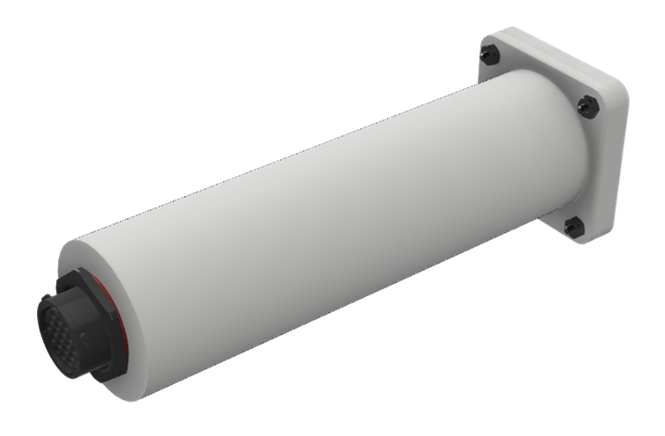
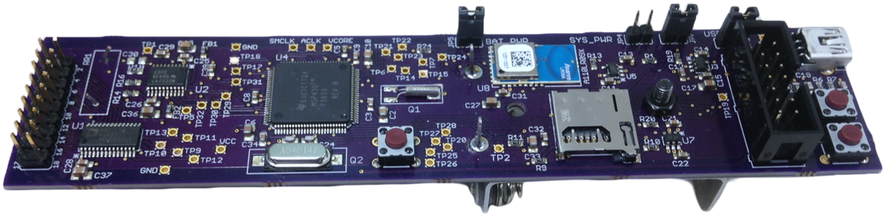
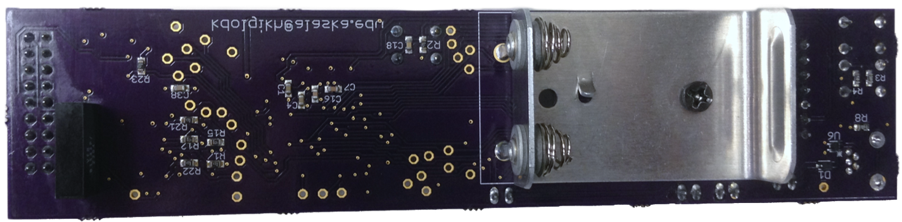
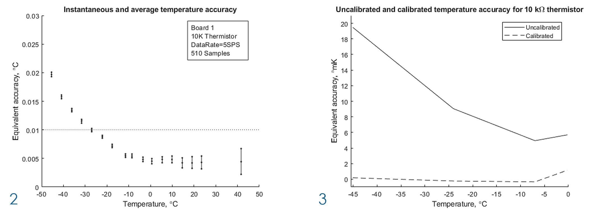
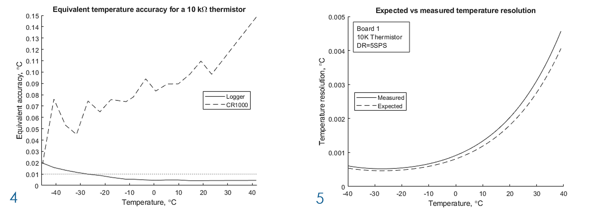
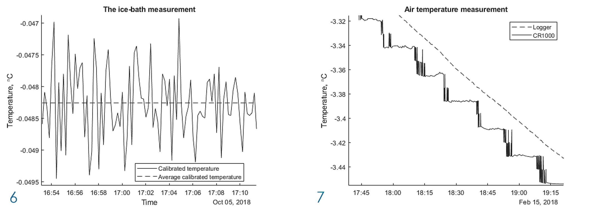
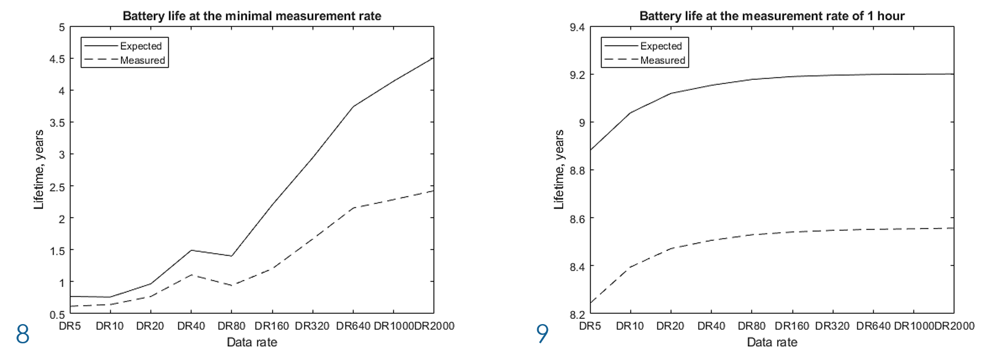
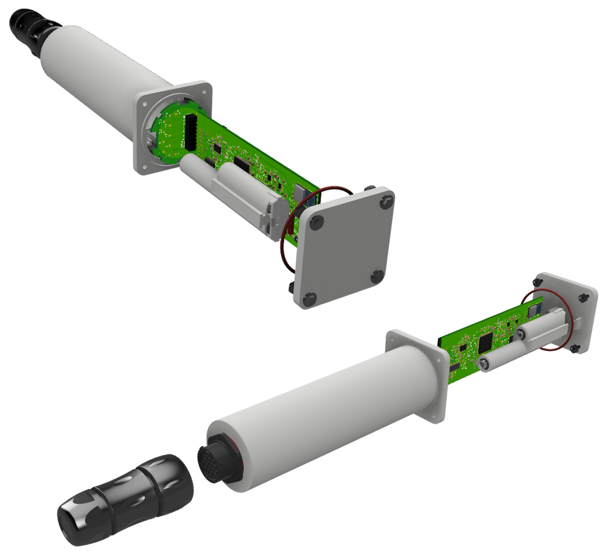

```{r setup, include=FALSE}
knitr::opts_chunk$set(echo = TRUE)
```


# Introduction

The UAF Geophysical Institute Permafrost Lab studies frozen soil and the changes it experiences due to the warming climate. The study includes measuring temperatures at different depths below the surface. Measurements are made with a 1.5 meters long thermistor probes installed in the ground or with thermistor strings or proprietary temperature sensors that are immersed into bore holes up to 90 meters deep. For the measurements, the Permafrost Lab currently uses CR10X [1] and CR1000 [2], both made by Campbell Scientific, Inc. and Onset Computer Corporation’s Hobo U12-series [3], [4] and UX120-006 [5] dataloggers. Scientists at the Permafrost Lab require the loggers to possess certain qualities with respect to the number of channels, temperature measurement performance, memory capacity, and battery life, as well as overall dimensions, weight, and waterproofness of the enclosure. The research on the commercially available dataloggers, including the above-mentioned ones, showed that there is no single logger on the market that will meet all the requirements posed by the Permafrost Lab scientists. This motivation drove the need to develop a new data logger, which could resolve small changes in temperature, was accurate, inexpensive, small, and had enough memory capacity and battery life to sustain through the long logging sessions. The prototype of such data logger has been developed and is presented below.

# Objectives

The objective of this work was to design, implement, and test the prototype of a multi-channel outdoor data logger with wireless capability (the Logger). The Logger had to meet the requirements posed by the Permafrost Lab, however it had to be adaptable so that it could be used by any researcher. The designed Logger had to have the following features:

* Compatibility with the existing thermistor probes and strings that use 10 kΩ nominal resistance thermistors.
* A multi-channel ADC (not fewer than 16 channels).
* The temperature data resolution of at least 0.01° C.
* The accuracy of at least 0.01° C near 0° C and less than 0.05° C elsewhere in the operating range of -40° to 40° C when making measurements with thermistors. 
* Maximum temperature range of -40° to +40° C.
* The ability to store hourly measurements from all channels for at least 2 years.
* Battery powered with battery life of at least 2 years.
* The Logger should allow user to update firmware in the field without special equipment.
* The ability to download data wirelessly and potentially participate in a wireless sensor network.
* The Logger size is less than about 3 cm in diameter.
* Waterproof enclosure.

# The Overview of the Designed Logger

* The Logger uses a 24-bit sigma-delta ADC with NTC thermistors as sensing elements; 5, 10, and 20 kΩ thermistors are supported. An analog signal multiplexer is used to connect 16 thermistors to the ADC.
* Data is stored into the internal memory and an optional micro-SD card of up to 2 GB providing storage for up to 42 million measurements for each channel.
* The Logger has two measurement modes: real-time clock and bulk. In the real-time clock mode, a 16-channel measurement is repeated at the user selectable rate maintained by the real-time clock timer. The minimum measurement rate is 2 seconds, while the maximum rate is not restricted. In the bulk mode, each channel’s measurement is repeated non-stop until the predefined number of memory segments is filled with data. This process repeats until the Logger’s memory is full.
* The supported output data rates with corresponding minimal measurement rates are: 5 SPS / 12 s, 10 SPS / 6 s, 20 SPS / 4 s. The minimal measurement rate for data rates of 40, 80, 160, 320, 640, 1000, and 2000 SPS is 2 seconds.
* The Logger’s estimated battery life is 8 years when making measurements once per hour.
* Data is retrieved using the USB interface. Additionally, the Logger has a radio transmitter, which will allow it to download data wirelessly and potentially participate in a wireless sensor network once the appropriate firmware is developed. Currently, only the communication protocol with the radio is implemented, while the radio-to-radio protocol is under development.
* The user interface is implemented in MATLAB. It is a command-line interface, which provides full control over the Logger.
* The Logger’s components are rated down to -40° C and the Logger successfully passed testing at ‑30° C.

Figure 1. The first prototype of the Logger: 


# Overview of the Results

* The extensive testing has shown that the Logger outperforms the Campbell Scientific, Inc. CR1000 logger and exceeds the design requirements. Measured temperature resolution of the Logger is less than 5 mK in the entire temperature range and less than 1 mK below 0° C. The Logger’s equivalent temperature accuracy, which was determined using a known resistive input, is below 10 mK within ‑25° C to 40° C and below 20 mK elsewhere. The developed calibration technique provides the equivalent accuracy below 0.3 mK within -40° C to 40° C. To provide an accuracy of ±0.01° C when making temperature measurements with thermistors, the Logger should be calibrated against a thermometer that has been calibrated as a secondary standard, which will be done in the future.
* To determine the effect of ambient temperature on a measurement accuracy, the series of experiments was conducted with the Logger operating at -30°, -25°, -20° and 6° C. It was noted that with the ambient temperature being lowered, the accuracy of measurements was increasing. 
* To evaluate the Logger’s ability to measure temperature, the ice-bath and the outside measurements were performed. The measured ice-bath temperature was -0.048 °C. In the outside measurements, the Logger demonstrated superior temperature resolution against the CR1000.
* Figures 2 – 9 summarize the testing results:









# Future work

Presented is the prototype of the data logger for precise soil temperature measurements that has 16 channels, can store up to 41.9 million measurements per channel, is capable of withstanding low temperatures, and can be adapted for other temperature measuring applications. The Logger exceeds most of the design requirements and outperforms one of the best commercially available loggers in terms of temperature measurements. Despite the encouraging accomplishments, there are still many things to be added to the current design. Firstly, a waterproof enclosure with a connector for thermistors should be manufactured and tested. Figures 10 and 11 show the renders of the complete device and the enclosure with the Logger and a battery pack respectively.

Figure 10. The render of the complete device:


Figure 11. The render of the enclosure with the Logger and a battery pack:


This short video shows the assembly process of the future device:

<video width="800" height="501" controls>
<source src="GI_Logger_video7.mp4" type="video/mp4">
</video>

Secondly, the are several firmware features to be implemented:
The mechanism that will keep track of the Logger’s temperature and calibrate its ADC when necessary.
The radio communication protocol for the wireless data download.
For the real-time clock mode, the ability to set different start options: delayed start, start at 00 minutes 00 seconds of the next hour, and start at the specified time.
The real-time clock calibration based on the Logger’s temperature.
The ability to do measurements when the Logger is connected to the host PC, so the user can verify the Logger’s proper operation before deploying it.
Additionally, a stand-alone multi-platform software for a graphical user interface should be developed instead of the command-line interface.
Thirdly, a multi-point calibration should be performed to provide the required accuracy of temperature measurements when using thermistors.
The final step, after the improved prototype is tested and calibrated, will be to check if it complies with the FCC regulations. Once this requirement is met, the production version of the Logger can be manufactured.

# Acknowledgements

The author is thankful to Dr. Dejan Raskovic, UAF for his valuable advice and guiding, Dr. Vladimir Romanovsky, UAF for giving me the idea for the device and providing financial support, William Cable and Dr. Denise Thorsen, UAF for their advice and for pointing me in the right direction.

# References

[1] Campbell Scientific, Inc., "CR10X. Datalogger for Measurement and Control," Campbell Scientific, Inc., [Online]. Available:
(https://www.campbellsci.com/cr10x)

[2] Campbell Scientic, Inc., "CR1000. Datalogger for Measurement and Control," Campbell Scientific, Inc., [Online]. Available:
(https://www.campbellsci.com/cr1000)

[3] Onset Computer Corp., "HOBO 4-Channel External Data Logger Part # U12-006," Onset Computer Corp., [Online]. Available: (http://www.onsetcomp.com/products/data-loggers/u12-006)

[4] Onset Computer Corp., "HOBO 4-Channel External Data Logger Part # U12-008," Onset Computer Corp., [Online]. Available: (http://www.onsetcomp.com/products/data-loggers/u12-008)

[5] Onset Computer Corp., "HOBO 4-Channel Analog Data Logger Part # UX120-006M," Onset Computer Corp., [Online]. Available: (http://www.onsetcomp.com/products/data-loggers/ux120-006m)

