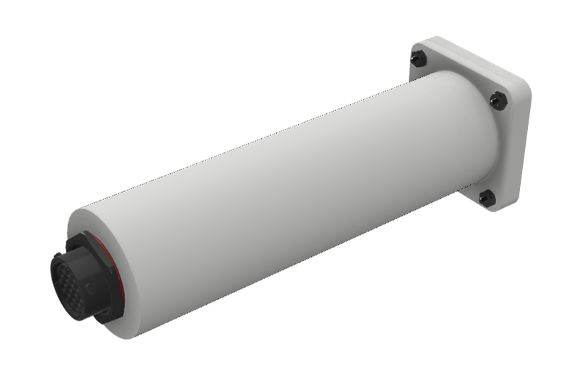
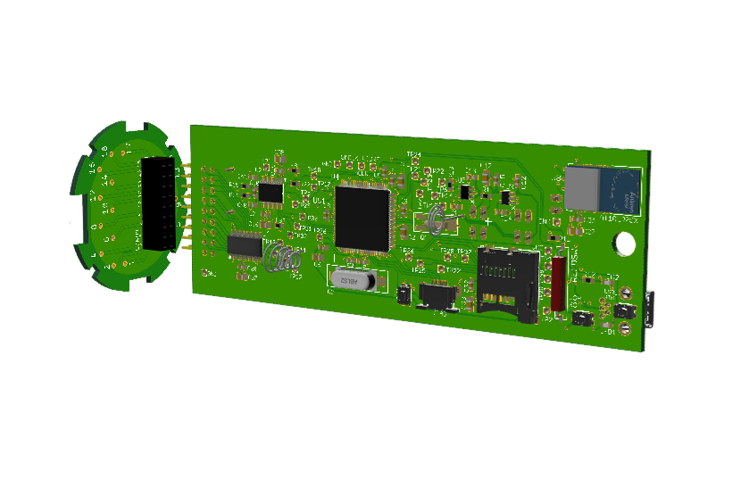
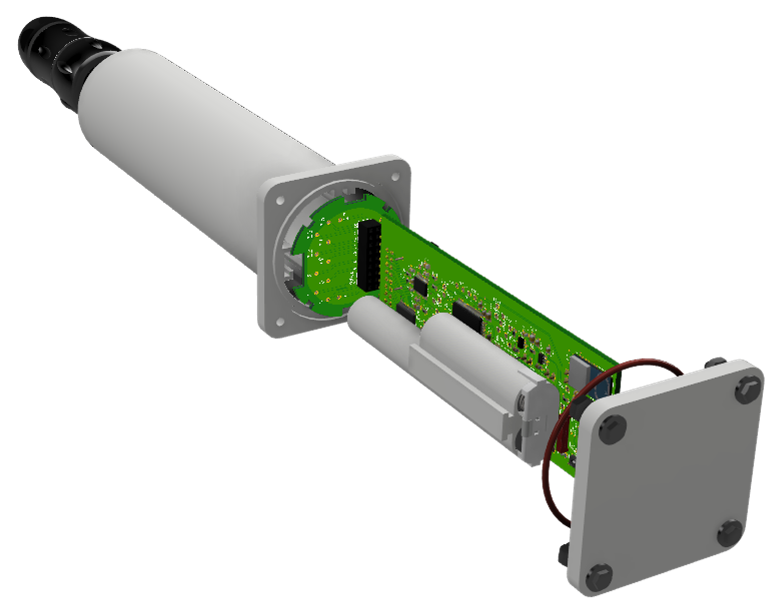
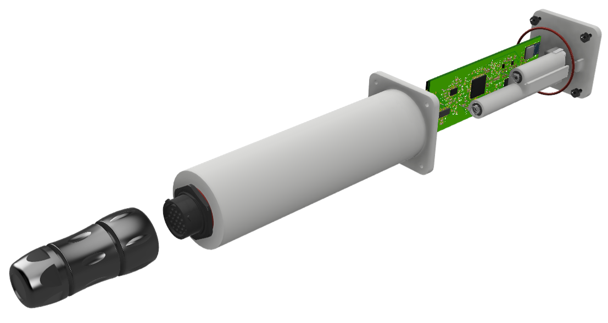

```{r setup, include=FALSE}
knitr::opts_chunk$set(echo = TRUE)
```

## Pics
image: 

pic2: 

pic3: 

image: 

## Video

<video width="800" height="501" controls>
<source src="GI_Logger_video7.mp4" type="video/mp4">
</video>